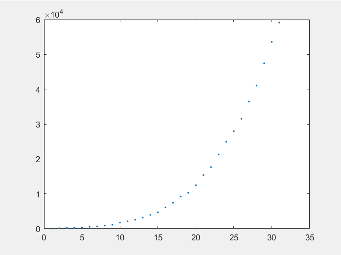
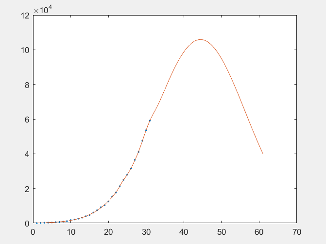
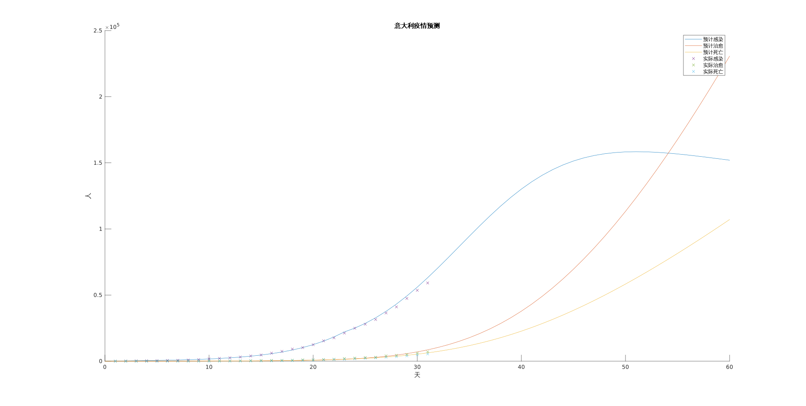

# 意大利新型冠状病毒发展预测

## 摘要

本文通过建立SEIR传染病模型，通过考虑病毒潜伏期传染能力，隔离时间，发病时间，隔离速率等因素，运用回归分析，用matlab建立微分方程，寻求解析解，运用梯度下降法对参数进行优化，从而使预测与现有数据实现更好的拟合，解决了新型冠状病毒疫情在意大利的预测问题。

## 问题重述

### 问题背景

2019新型冠状病毒(2019-nCoV)，2020年1月12日被世界卫生组织命名。冠状病毒是一个大型病毒家族，已知可引起感冒以及中东呼吸综合征(MERS)和严重急性呼吸综合征(SARS)等较严重疾病。新型冠状病毒是以前从未在人体中发现的冠状病毒新毒株。

2019年12月以来，湖北省武汉市持续开展流感及相关疾病监测，发现多起病毒性肺炎病例，均诊断为病毒性肺炎/肺部感染。

截至美国东部时间3月21日9时13分(北京时间3月21日21时13分)，全球新冠肺炎确诊病例累计达284566例，死亡病例达11868例。

其中，中国以外，意大利、西班牙、伊朗和德国四国确诊病例超2万；意大利专家称，该国病毒传播或早于中国疫情暴发；非洲疫情已蔓延至40个国家，确诊病例过千。近日来，又有多艘邮轮上的乘客确诊，全球邮轮业大范围停航。

### 题目信息

“新冠病毒已经在世界100多个国家蔓延，请选择一个国家，收集该国近一个多月的确诊病人数量，治愈数量和死亡人数，通过建立疾病传播模型，估计参数，预测其未来确诊病人数量，作出相应的图形，对结果进行分析。”

经过资料收集与探讨，本组选择意大利作为确诊病人数预测与分析的目标国家。

## 问题分析
### 数据采集与初步分析

- 首先，我们通过[百度疫情实时大数据报告](https://voice.baidu.com/act/newpneumonia/newpneumonia/?from=osari_pc_3)<sup>1</sup>获取最新意大利疫情数据以供参考；

- 其次，我们通过由GitHub项目[Wuhan-2019-nCoV](https://github.com/canghailan/Wuhan-2019-nCoV)<sup>2</sup>所开放的数据接口获取了过去40天意大利每日的新增确诊人数、新增死亡人数、新增治愈人数等具体数据信息，经初步观察后选取了确诊数量开始明显增长的2月22日-3月23日的数据用作拟合比对，并绘制出日期(以2月22日作为第0日)-确诊数量(单位：人)图如下：



- 借助Matlab2019内置的Curve Fitting工具对其进行暴力拟合，从而获得一个可以表示其变化趋势的函数结果

  - 经过多次尝试发现高斯拟合三项式结果比较能表现其变化趋势且此时和方误差$SSE=7.6098\times10^5$；
  - 得出拟合结果为$y = a_1e^{(-((x-b_1)/c_1)^2)} + a_2e^{(-((x-b_2)/c_2)^2)}+a_3e^{(-((x-b_3)/c_3)^2)}$，其中：

  ```
  a1 =        3432;
  b1 =       29.66;
  c1 =       2.124;
  a2 =       969.3;
  b2 =        22.8;
  c2 =       1.037;
  a3 =   1.059e+05;
  b3 =       43.44;
  c3 =       16.78;
  ```

  - 拟合所得图像如下：



- 结合以上图像可知，确诊人数随时间变化趋势为先上升，然后速度逐渐下降达到拐点，即极大值点，之后保持下降趋势，这与传统的传染病模型的结果保持一致，于是我们考虑以传统的传染病模型作为基础加以改进，从而实现对于意大利确诊人数的分析与预测。

### 传统模型

#### 模型假设

一般把传染病流行范围内的人群分成如下几类：

1. S 类，易感者 (Susceptible)，指未得病者，但缺乏免疫能力，与感染者接触后容易受到感染；

2. E 类，暴露者 (Exposed)，指接触过感染者，但暂无能力传染给其他人的人，对潜伏期长的传染病适用；

3. I 类，感病者 (Infectious)，指染上传染病的人，可以传播给S类成员，将其变为E类或I类成员；

4. R 类，康复者 (Recovered)，指被隔离或因病愈而具有免疫力的人。如免疫期有限，R类成员可以重新变为S类。

#### 几种常见模型

- SI模型： 将人群分为S类和I类，相关参数为传染率$\beta$，只考虑爆发和传播的过程；
- SIR模型：相比SI模型进一步考虑了病人的康复过程 ，增加R类以及康复率$\gamma$；
- SIRS模型：如果所研究的传染病为非致死性的，但康复后获得的免疫不能终身保持，则康复者 R 可能再次变为易感者S，相比SIR模型增加了免疫的平均保持时间$\alpha$；
- SEIR模型：如果所研究的传染病有一定的潜伏期，与病人接触过的健康人并不马上患病，而是成为病原体的携带者，归入E类，相比SIR模型增加了E类和潜伏期发展为患者的速率$\alpha$，且将康复率分为了潜伏期康复率$\gamma_1$和患者康复率$\gamma_2$。

#### 模型选择

经过调查分析目前的新闻报导以及相关论文资料，我们发现目前研究结果表明：新型冠状病毒的康复者对于该病毒的免疫力不会消除；且新型冠状病毒感染者具有潜伏期，潜伏期的感染者具有传染性。因此SEIR模型比较符合这次新型冠状病毒的疫情的情况。于是我们选择以传统的SEIR模型为基础，开展进一步研究。

### 资料分析

经典SEIR模型将人群分为S (Susceptible，易感者)，I (Infected，感染者)，E (Exposed，潜伏者)和R (Recovered，康复人群)。该模型还假设人群中所有个体都有机率被感染，当被感染个体痊愈后，会产生抗体，即康复人群R不会再被感染。考虑到防治传染病的隔离措施，模型中的人群组分新增Sq (隔离易感者)，Eq (隔离潜伏者)和Iq (隔离感染者)。鉴于隔离感染者会立即送往定点医院隔离治疗，因此这部分人群在本模型中全部转化为住院患者H 代替。进而，原人群S，I，E 则分别指隔离措施遗漏的易感者、感染者和潜伏者。隔离易感者解除隔离后重新转变为易感者，而感染者和潜伏者均有不同程度的能力感染易感者，使其转化为潜伏者。

## 模型假设

### 参数符号说明

$$
c,接触率\\
\beta,传染概率\\
\delta_{I},传染者隔离速率\\
\delta_q,隔离者向传染者转化速率\\
\gamma_I,感染者恢复率\\
\gamma_H,隔离感染者恢复率\\
q,隔离比例\\
\alpha,死亡率\\
\theta,潜伏着相对于感染者传播能力的比值\\
\lambda,隔离解除速率(即\frac{1}{隔离时长(天)})\\
\sigma,潜伏者向感染者的转化速率(即\frac{1}{潜伏期时长(天)})
$$

### 变量符号说明

$$
S,易感者数量\\
E,潜伏者数量\\
I,感染者数量\\
S_q,隔离易感者数量\\
E_q,隔离潜伏者数量\\
H,住院患者数量\\
R,康复者数量\\
D,死亡感染者数量
$$

### 假设条件

- 不存在人传人以外的病毒传播方式，如尸体或动物传播等；
- 忽略国际流动人口带来的影响；
- 不存在有效的治疗方案或是非康复后获取的免疫能力；
- 不考虑人之间的个体差异，如年龄、性别或是体质等；
- 不考虑由于环境或是医疗系统承载能力有限带来的影响；
- 所有隔离感染者立即送至医院接受住院隔离治疗。

## 模型建立及求解

根据原理，可建立如下微分方程组：
$$
\left\{
\begin{split}
\frac{dS}{dt} &= -[c \beta + c q (1 - \beta)]S(I + \theta E) + \lambda S_q \\
\frac{dE}{dt} &= c \beta (1 - q) S (I + \theta E) - \sigma E \\
\frac{dI}{dt} &= \sigma E - (\delta_I + \alpha + \gamma_I) I \\
\frac{dS_q}{dt} &= c q (1 - \beta) S (I + \theta E) - \delta_q E_q \\
\frac{dE_q}{dt} &= c q \beta S (I + \theta E) - \delta_q E_q \\
\frac{dH}{dt} &= \delta_I I + \delta_q E_q - (\alpha + \gamma_H) H \\
\frac{dR}{dt} &= \gamma_I I + \gamma_H H \\
\frac{dD}{dt} &= \alpha(I + H)
\end{split}
\right.
$$

其中，$ \sigma $ 为潜伏着转化为感染者的速率， $ \alpha $ 为死亡率（同时作用于感染者和隔离治疗人员）， $ \delta_I $ 和 $ \delta_q $ 分别为感染者和潜伏者被隔离的速率， $ \gamma_I $ 和 $ \gamma_H $ 分别为感染者和隔离治疗人员康复的速率。

方便起见，该微分方程组不进行数值求解，而是以 $ t = 0.01 $ 天为间隔进行迭代，即：
$$
\left\{
\begin{split}
S_{i + 1} &= S_i + \frac{dS}{dt} \cdot t \\
E_{i + 1} &= E_i + \frac{dE}{dt} \cdot t \\
I_{i + 1} &= I_i + \frac{dI}{dt} \cdot t \\
S_{q(i + 1)} &= S_{qi} + \frac{dS_q}{dt} \cdot t \\
E_{q(i + 1)} &= E_{qi} + \frac{dE_q}{dt} \cdot t \\
H_{i + 1} &= H_i + \frac{dH}{dt} \cdot t \\
R_{i + 1} &= R_i + \frac{dR}{dt} \cdot t \\
D_{i + 1} &= D_i + \frac{dD}{dt} \cdot t \\
\end{split}
\right.
$$
其中 $ S_i $ 为第 $ i $ 次迭代的值， $ E_i, I_i, S_{qi}, E_{qi}, H_i, R_i, D_i $ 类似。

## 结果及分析



## 参考文献

1.Estimation of the transmission risk of 2019-nCov and its implication for public health interventions Biao Tang , Xia Wang , Qian Li , Nicola Luigi Bragazzi , Sanyi Tang , Yanni Xiao , Jianhong Wu

2.2019-nCoV新型冠状病毒肺炎SEIR传播动力学模型分析  曹盛力 冯沛华 时朋朋 

## 附录

```matlab
hold on

% Model parameters

c        = 2.75;
beta     = 1.74e-9;
delta_I0 = 0.1;
delta_q  = 0.13;
gama_I   = 0.001;
gama_H   = 0.03;
q        = 2e-7;
alpha    = 0.009;
theta    = 0.75;
lam      = 1/14;
sigma    = 1 / 7;

% Simulation parameters

T  = 60;
t  = 0.01;
NN = T/t;

% Initial values

S  = 60481283;
E  = 620;
I  = 33 * 2;
Sq = 0;
Eq = 2;
H  = I + Eq;
R = 2;
D = 0;

G = zeros(NN, 8);
G(1, :) = [S E I Sq Eq H R D];

for ii = 1 : NN
    if (ii * t) >= 23
        delta_I = delta_I0 * 1.7;
    else
        delta_I = delta_I0;
    end
    
    dS  = -(beta * c + c * q * (1 - beta)) * S * (I + theta * E) + lam * Sq;
    dE  = beta * c * (1 - q) * S * (I + theta * E) - sigma * E;
    dI  = sigma * E - (delta_I + alpha + gama_I) * I;
    dSq = (1 - beta) * c * q * S * (I + theta * E) - lam * Sq;
    dEq = beta * c * q * S * (I + theta * E) - delta_q * Eq;
    dH  = delta_I * I + delta_q * Eq - (alpha + gama_H) * H;
    dR  = gama_I * I + gama_H * H;
    dD  = alpha * I + alpha * H;

    S  = S  + dS  * t;
    E  = E  + dE  * t;
    I  = I  + dI  * t;
    Sq = Sq + dSq * t;
    Eq = Eq + dEq * t;
    H  = H  + dH  * t;
    R  = R  + dR  * t;
    D  = D  + dD  * t;
    
    G(ii + 1, :) = [S E I Sq Eq H R D];
end

% Simulation result

yI(:, 1) = round(G(1 : 1/t : size(G, 1), 3));
yR(:, 1) = round(G(1 : 1/t : size(G, 1), 7));
yD(:, 1) = round(G(1 : 1/t : size(G, 1), 8));

plot(0 : T, [yI, yR, yD])

% Raw data

raw = importdata('意大利.csv');

rI = raw.data(:, 1);
rR = raw.data(:, 3);
rD = raw.data(:, 4);

plot(1 : length(rI), [rI, rR, rD],'x');

legend 预计感染 预计治愈 预计死亡 实际感染 实际治愈 实际死亡
title 意大利疫情预测
xlabel 天
ylabel 人
```
